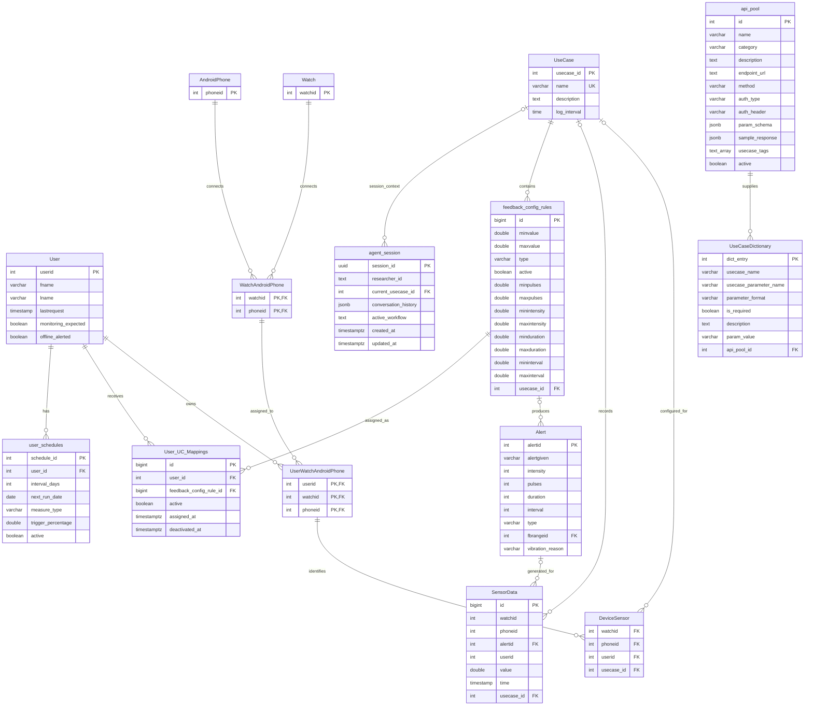

# Full ERD Schema

[REMOVED FOR ANONYMITY]

#### Mermaid format (image below)

```mermaid
erDiagram
    User {
        int userid PK
        varchar fname
        varchar lname
        timestamp lastrequest
        boolean monitoring_expected
        boolean offline_alerted
    }

    Watch {
        int watchid PK
    }

    AndroidPhone {
        int phoneid PK
    }

    WatchAndroidPhone {
        int watchid PK, FK
        int phoneid PK, FK
    }

    UserWatchAndroidPhone {
        int userid PK, FK
        int watchid PK, FK
        int phoneid PK, FK
    }

    DeviceSensor {
        int watchid FK
        int phoneid FK
        int userid FK
        int usecase_id FK
    }

    UseCase {
        int usecase_id PK
        varchar name UK
        text description
        time log_interval
    }

    SensorData {
        bigint id PK
        int watchid
        int phoneid
        int alertid FK
        int userid
        double value
        timestamp time
        int usecase_id FK
    }

    Alert {
        int alertid PK
        varchar alertgiven
        int intensity
        int pulses
        int duration
        int interval
        varchar type
        int fbrangeid FK
        varchar vibration_reason
    }

    feedback_config_rules {
        bigint id PK
        double minvalue
        double maxvalue
        varchar type
        boolean active
        double minpulses
        double maxpulses
        double minintensity
        double maxintensity
        double minduration
        double maxduration
        double mininterval
        double maxinterval
        int usecase_id FK
    }

    User_UC_Mappings {
        bigint id PK
        int user_id FK
        bigint feedback_config_rule_id FK
        boolean active
        timestamptz assigned_at
        timestamptz deactivated_at
    }

    user_schedules {
        int schedule_id PK
        int user_id FK
        int interval_days
        date next_run_date
        varchar measure_type
        double trigger_percentage
        boolean active
    }

    agent_session {
        uuid session_id PK
        text researcher_id
        int current_usecase_id FK
        jsonb conversation_history
        text active_workflow
        timestamptz created_at
        timestamptz updated_at
    }

    api_pool {
        int id PK
        varchar name
        varchar category
        text description
        text endpoint_url
        varchar method
        varchar auth_type
        varchar auth_header
        jsonb param_schema
        jsonb sample_response
        text_array usecase_tags
        boolean active
    }

    UseCaseDictionary {
        int dict_entry PK
        varchar usecase_name
        varchar usecase_parameter_name
        varchar parameter_format
        boolean is_required
        text description
        varchar param_value
        int api_pool_id FK
    }

    Watch ||--o{ WatchAndroidPhone : connects
    AndroidPhone ||--o{ WatchAndroidPhone : connects

    User ||--o{ UserWatchAndroidPhone : owns
    WatchAndroidPhone ||--o{ UserWatchAndroidPhone : assigned_to

    UserWatchAndroidPhone ||--o{ DeviceSensor : identifies
    UseCase o|--o{ DeviceSensor : configured_for

    Alert o|--o{ SensorData : generated_for
    UseCase o|--o{ SensorData : records

    feedback_config_rules o|--o{ Alert : produces
    UseCase ||--o{ feedback_config_rules : contains

    User ||--o{ User_UC_Mappings : receives
    feedback_config_rules ||--o{ User_UC_Mappings : assigned_as

    User ||--o{ user_schedules : has
    UseCase o|--o{ agent_session : session_context

    api_pool ||--o{ UseCaseDictionary : supplies
```